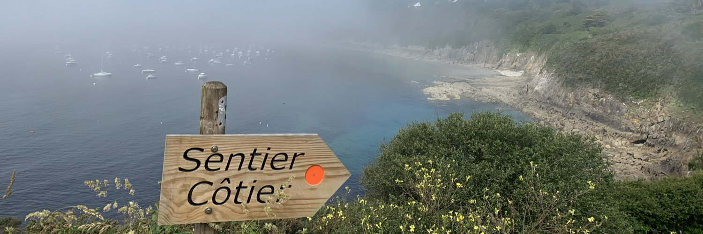

I am a postdoctoral researcher at Laboratoire d'Océanographie Physique et Spatiale (LOPS) in Ifremer, Brest, France. Before that, I obtained my PhD in the University of Southampton, UK. 
My research focuses on upper-ocean dynamics associated with a wide range of processes, from geostrophically balanced mesoscale eddies, submesoscale unstable fronts to unbalanced inertia-gravity waves. I mainly use in situ observations collected from moorings, seagliders, surface drifting buoys and satellite altimeters, and simulation outputs from tide- and eddy-resolving high-resolution ocean models. 

[//]: # ()

[//]: 

Education
======
- BSc in Oceanography, Xiamen University, China, 2006.09 - 2010.06

- MSc in Physical Oceanography, Xiamen University, China, 2010.09 - 2013.06

- PhD in Physical Oceanography, University of Southampton, UK, 2013.10 - 2018.01

Work experience
======
- Postdoc at Ifremer, France, 2018.04 - present

