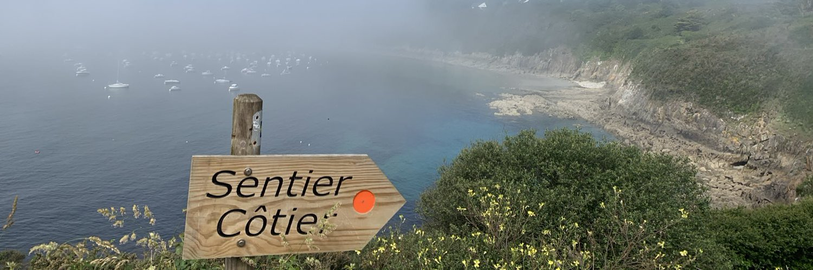

Education
======
- BSc in Oceanography, Xiamen University, China, 2006.09 - 2010.06

- MSc in Physical Oceanography, Xiamen University, China, 2010.09 - 2013.06

- PhD in Physical Oceanography, Univeristy of Southampton, UK, 2013.10 - 2018.01

Work experience
======
- Postdoc at Ifremer, France, 2018.04 - present

