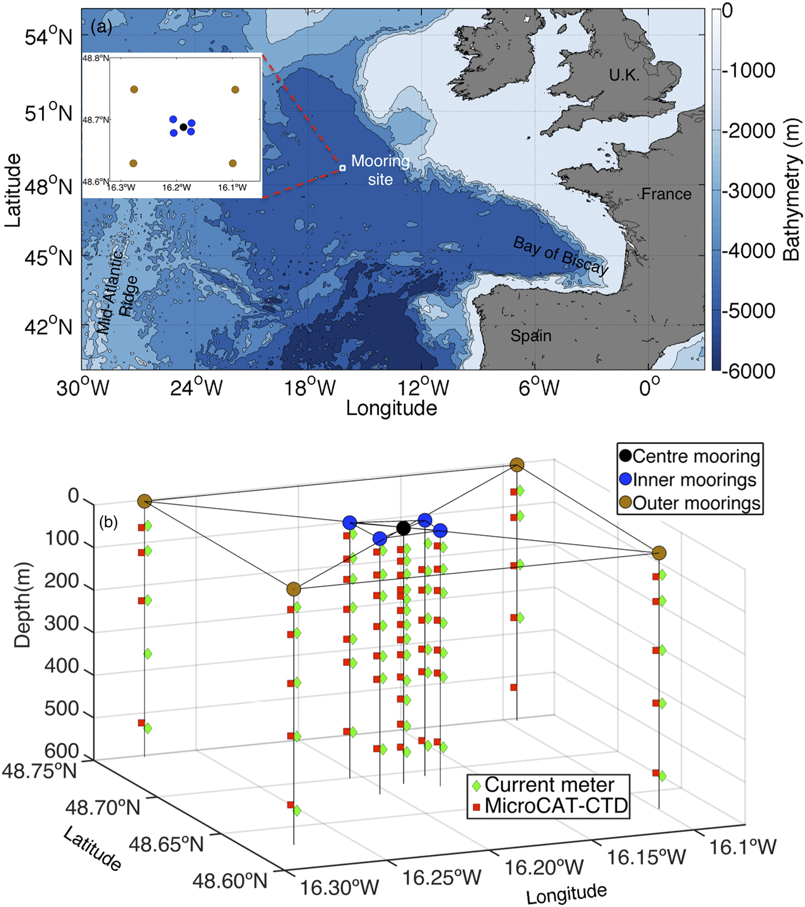

The ocean surface boundary layer is a fundamental component of the global climate system, and plays a critical role in mediating the vertical exchange of both physical and biogeochemical tracers between the atmosphere and the ocean interior. My current research aims to improve our understanding on the role of submesoscale processes in the ocean surface boundary layer.

Mooring site            |  vertical buoyancy flux
:-------------------------:|:-------------------------:
  |  

<h2>More coming soon...</h2>

