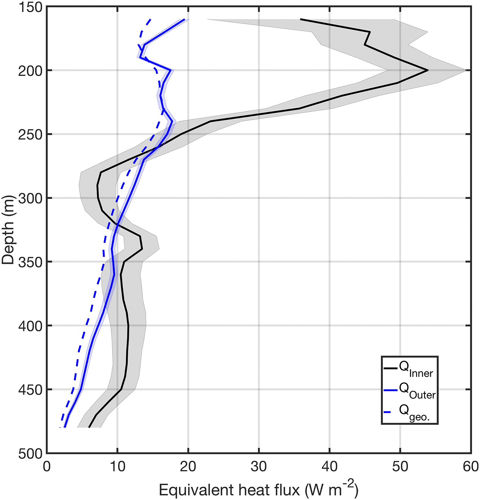
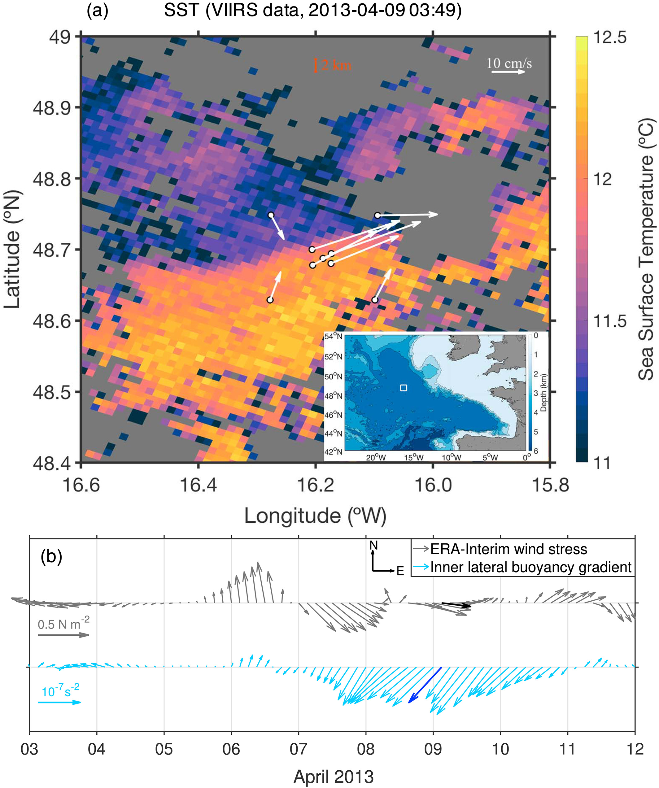
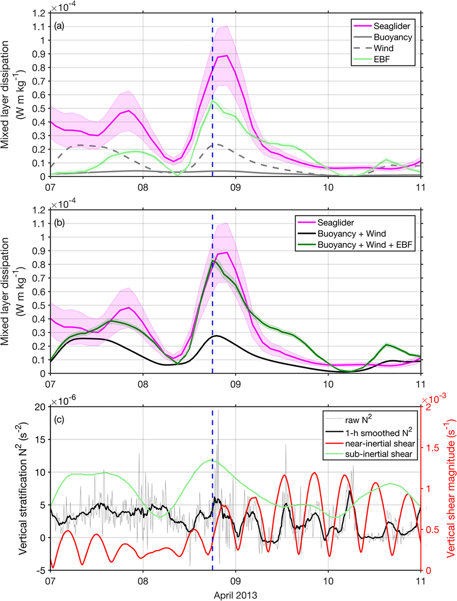

<h2>Ocean submesoscales</h2>

The ocean surface boundary layer is a fundamental component of the global climate system, and plays a critical role in mediating the vertical exchange of both physical and biogeochemical tracers between the atmosphere and the ocean interior. My PhD work as part of the OSMOSIS project aims to improve our understanding on the role of submesoscale processes in the ocean surface boundary layer, based on year-long measurements from an array of nine moorings in the Northeast Atlantic Ocean.

My work investigates an annual cycle of the submesoscale dynamics in terms of vertical velocity, potential vorticity and instability. Submesoscale vertical flows are found  to drive significant upper-ocean restratification in response to the enhancement of submesoscale lateral fronts in the presence of intense mesoscale frontogenesis. Our results also show that wind forcing of fronts is centrally involved in symmetric and gravitational instabilities, which play a key role in determining the evolution of the ocean surface boundary layer.

Mooring site            |  vertical buoyancy flux
:-------------------------:|:-------------------------:
  |  

<h2>Observational evidence of symmetric instability</h2>

we conduct a case study of a SI event in this mid‐ocean setting, based on four lines of direct observational evidence: (i) Upper‐ocean kinetic energy is enhanced during the SI event, as expected from the active development of a submesoscale instability; (ii) the event is associated with downfront winds and mesoscale frontogenesis, conditions that favor the onset of SI and that are regularly met in mid‐ocean environments; (iii) a shoaling of the mixed layer is observed, consistent with theoretical predictions for SI; and (iv) dissipation is elevated in a manner quantitatively consistent with SI extracting kinetic energy from the background flow, which is broadly in geostrophic balance.

The transient front            |  Enhanced dissipation
:-------------------------:|:-------------------------:
  |  

<h2>More coming soon...</h2>

